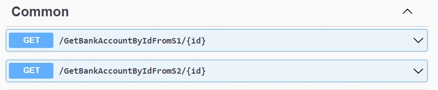
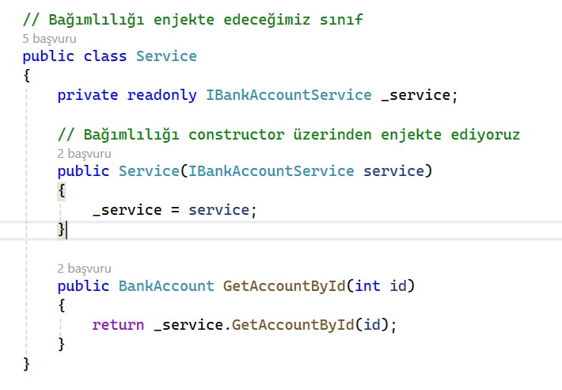
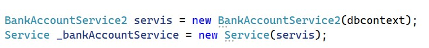
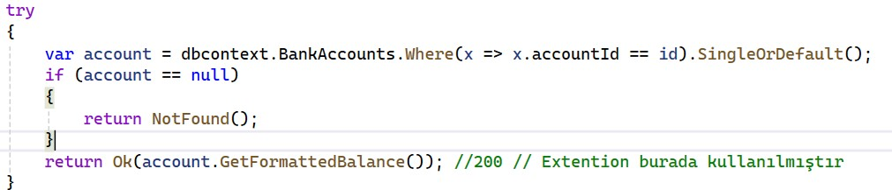
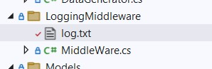

# Akbank .Net Bootcamp Cohort Ödevi 2

Akbank ve patikadev tarafından gerçekleştirilen Asp.Net eğitimi sürecinde verilen cohort üzerinden verilen ikinci hafta ödev.

[Akbank .Net Bootcamp Cohort Ödev 1 GitHub linki](https://github.com/ysfArslan1/Ab-pk-week1)

## Bizden İstenenler:
- İlk hafta geliştirdiğiniz API kullanılacaktır.
- Rest standartlarına uygun olmalıdır.
- SOLID prensiplerine uyulmalıdır.
- Fake servisler geliştirilerek Dependency Injection kullanılmalıdır.
- API'nizde kullanılmak üzere extension geliştirin.
- Projede Swagger implementasyonu gerçekleştirilmelidir.
- Global loglama yapan bir middleware (örneğin, sadece actiona girildi gibi çok basit düzeyde) oluşturulmalıdır.

## Servisler ve Dependency Injection:
Dependency Injection görevini tamamlamak için `Services/` klasörü altında iki tane servis oluşturdum. İlk olarak `IBankAccountService` interfacesini oluşturdum, ardından bu interfaceden kalıtım alan `BankAccountService1` ve `BankAccountService2` sınıflarını geliştirdim. Dependency Injection kullanımı için `Service` sınıfını oluşturdum.

- `GET /GetBankAccountByIdFromS1/{id}`:
  Servis 1'i kullanarak Banka hesabı alan metot.

- `GET /GetBankAccountByIdFromS2/{id}`:
  Servis 2'i kullanarak Banka hesabı alan metot.

## Extension Geliştirme:
CommonControllerde kullanılmak üzere BankAccount sınıfında bulunan `GetFormattedBalance` metodu geliştirildi.

- `GET /GetBankAccountBalanceById/{id}`:
  Bu metot, BankAccount sınıfından extension edilen `GetFormattedBalance` metodu kullanılarak oluşturuldu.
  
  

## Middleware Oluşturma:
Projedeki request ve response'ların `LoggingMiddleware/log.txt` dosyasına loglanması için `LoggingMiddleware/Middleware.cs` dosyasını oluşturdum.

